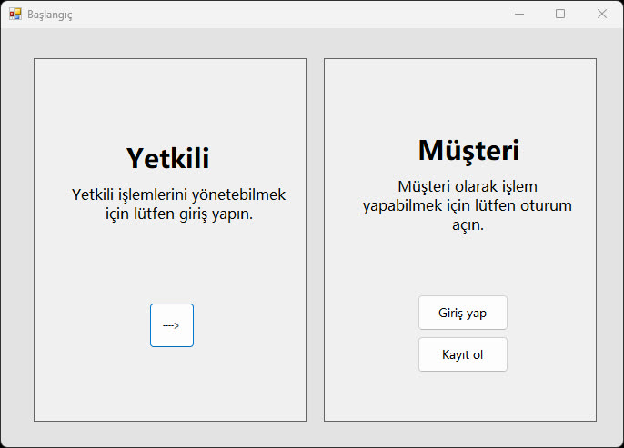
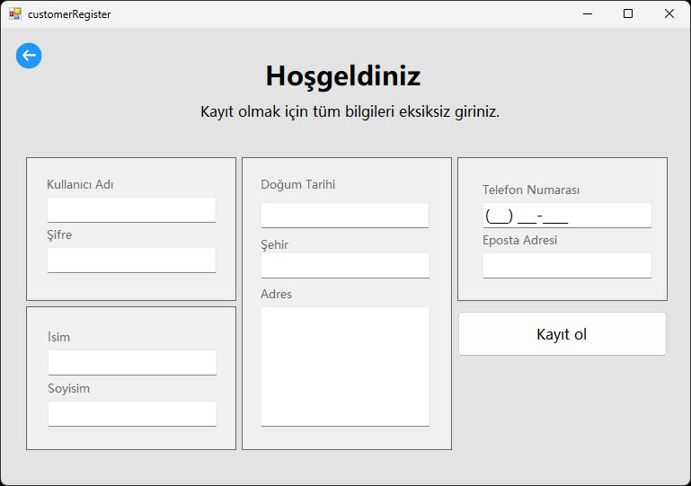
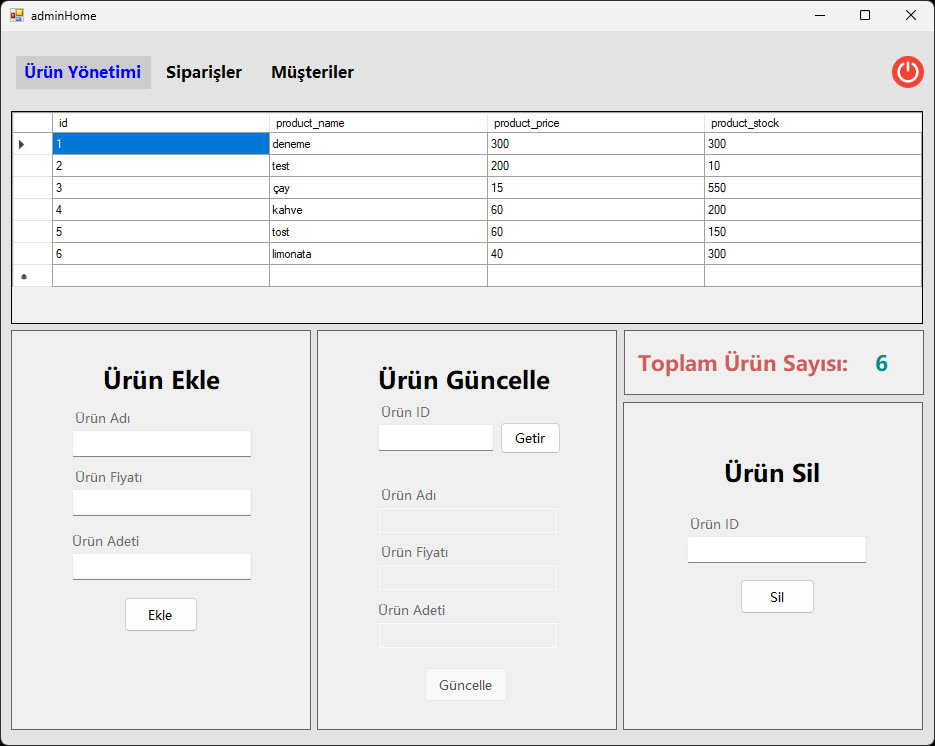
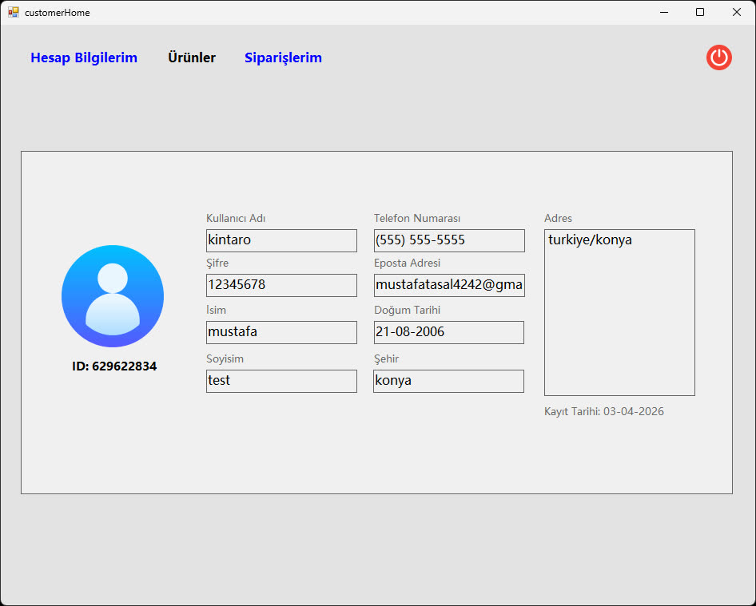
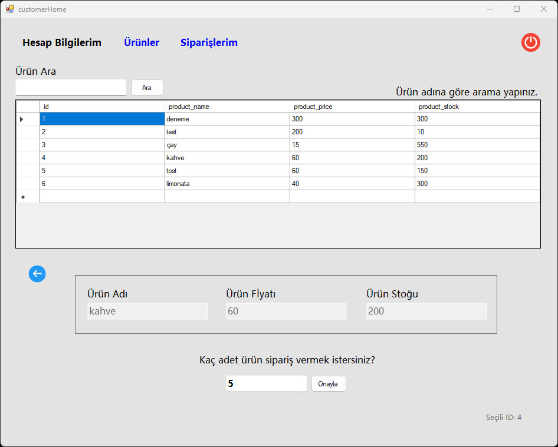
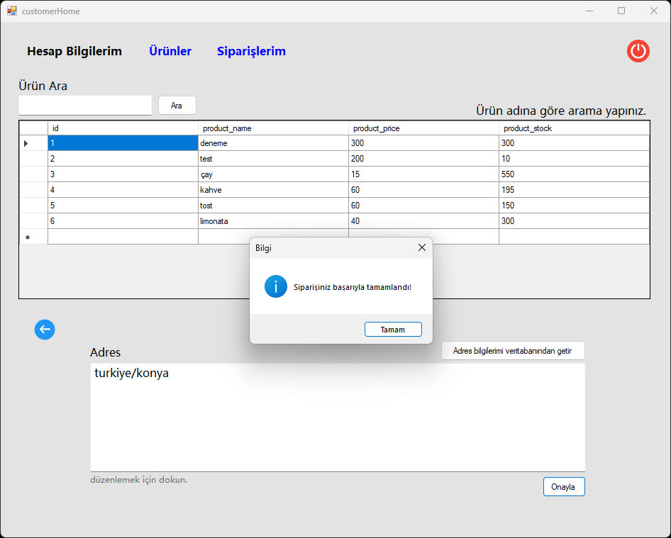

## 📋 About

**TR - TÜRKÇE**

Bu proje, lise yıllarımda C# WinForms ve MySQL kullanarak hazırladığım bir dönem ödevi. İçeriği oldukça basit ve anlaşılır tutmaya çalışmıştım. Temel olarak; ürün ekleme, silme, güncelleme gibi stok takip işlemlerini yapabiliyorsunuz. Ayrıca hem kullanıcı hem de yönetici girişi gibi özellikleri de mevcut. Eski ama hatırası olan bir çalışma olduğu için burada paylaşıyorum.

##

**EN - ENGLISH**

This is a high school project I developed as an assignment using C# WinForms and MySQL. It's a simple stock management system where you can perform basic operations like adding, deleting, and updating products. It also features separate login systems for users and admins. I'm sharing it as it is, as a nice memory from my high school years.

##

##

##

##

##

##

